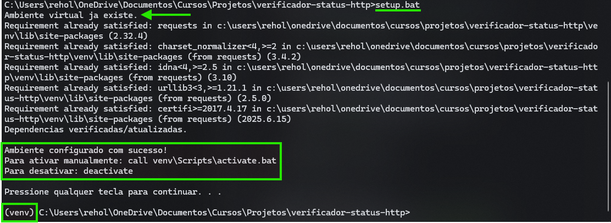

# Verificador de Status Code HTTP

Um script Python para verificar o status code HTTP de múltiplos sites.


## Como usar 


### No Linux

1. Configure o ambiente virtual executando os seguintes comandos:
    ```bash
    chmod +x setup.sh
    ```
    ```bash
    ./setup.sh
    ```

2. Caso já tenha configurado o ambiente virtual, apenas ative-o:
    ```bash
    source venv/bin/activate
    ```

3. Edite o arquivo `sites.txt` com os sites que deseja verificar (um por linha)

4. Execute o verificador:
    ```bash
    python check_sites.py
    ```

5. Ao final, desative o ambiente virtual:
    ```bash
    deactivate
    ```

### No Windows

1. Para configurar o ambiente virtual dê um duplo clique em `setup.bat` ou execute no CMD:
    ```cmd
    setup.bat
    ```
    

2. Edite o arquivo `sites.txt` com os sites que deseja verificar (um por linha)

3. Execute o verificador:
    ```cmd
    python check_sites.py
    ```

4. Ao final, desative o ambiente virtual:
    ```cmd
    deactivate
    ```


### Dependências

* Python 3.6+
* requests (instalado automaticamente pelo arquivo `setup.sh` ou `setup.bat`)


### Arquivos

* `sites.txt`: Lista de sites para verificar;
* `sites_status.csv`: Resultados das verificações;
* `check_sites.py`: Script principal;
* `requirements.txt`: Dependências;
* `setup.sh`: Script de configuração do ambiente no Linux;
* `setup.bat`: Script de configuração do ambiente no Windows;
* `README.md`: Documentação.
